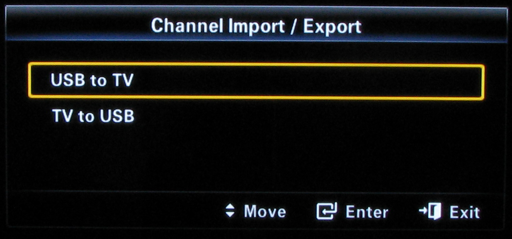

## SamygoChanEdit

Program to reorder channels for samsung TVs

## System configuration

By now, this project depends on swt eclipse library. You need to install it on your system.

    # apt-get install libswt

or

    # pacman -S swt

should do de work. After that, might be neccesary to link libswt-\*.so to `~/.swt/linux/x86_64/`. This package files to see the exact ln command needed

    $ ln -s /usr/lib/libswt-* ~/.swt/linux/x86_64/

## Compilation

Although mavenize this project is a simple task, a simple bunch of simple scripts are enough to compile, pack and execute. Here is a quick guide:

    $ hub clone albfan/samygochanedit
    $ cd samygochanedit
    $ ./scripts/build.sh
    $ ./scripts/pack.sh
    $ ./scripts/execute.sh
    $ ./scripts/clean.sh

All this scripts relay on `JDK_HOME` environment variable to locate your java toolchain. If java and javac are in your path you can ignore this setting.

swt library is assumed to be on `/usr/share/java`. If that is not your case, or want to try a particular version, export `SWT_LIB` env.

## Use

First, you need to export your channels to something editable.

With TV on:

 - Insert an usb on tv. press  and release
 - Press  button for 10 seconds.
 - You will see a hide menu to export configuration to usb

 - Choose **tv to usb** A set of files will be saved to a directory named after your firmware name *TCHLDEUC* or the like.
 - Extract usb and insert on your system
 - execute samygochanedit
 - Open aproppiate files with it -normally files with *-D* in its name- and edit or reorder your channels to your liking
     - `Ctrl+F` find a channel by name
     - `Ctrl+M` move a channel
     - `Enter` edit channel properties
 - Save file (same location) 
 - Connect usb to TV.
 - Launch hide import/export menu again.
 - Choose **usb to tv** this time.
 - Wait for TV restart, and your channels will be changed.

## History
    	
This repo is a recopilation from http://www.polskafan.de/ and http://sourceforge.net/projects/samygochanedit

